# Game Basic Information #

## Summary ##

Our game is heavily inspired by older, top-down Legend of Zelda games. The twist we put on it is that you have a set of spellcards that you draw from a deck. Whenever you use a spellcard you have to draw a new one from the deck. This introduces a randomness of your possible moves that requires you to keep on your toes, and makes it so even a short version of this game is different every time.

## Gameplay Explanation ##

**In this section, explain how the game should be played. Treat this as a manual within a game. It is encouraged to explain the button mappings and the most optimal gameplay strategy.**

The player can move around the map using the arrow keys, swing the sword using the space bar, and cast the spells on the cards using the 1, 2, 3 keys. The cards switch out every time they're used, so the player has to keep track of what cards they have tied to each button. The player's goal is to find the cave and locate the treasure within. Monsters and puzzles stand in the player's way.

The main quest guide:
1. Locate the cave which is to the west.
2. Fight monsters as you reach the cave. (Tip: fireball deals big damage to tree monsters)
3. Carefully read the signpost inside the cave that tells you how to solve the puzzle.
4. Solve the puzzle by walking and swimming to the right spot and lighting the torches that trigger the rocks inside the river to rise.
5. The rocks will support the player from the river streams, helping the player to advance.
6. If two of the torches on the left are lit, there will be enough rocks in the river that supports the player to reach the combat room.
7. When the player enters the combat room, the exit gets blocked by a rock, so the player needs to fight the enemies.
8. When the enemies are cleared, the player can light the last torch that destroys the rock that blocks the exit. This torch will also trigger the last rock that supports the player from the river streams.
9. The player exits the combat room and follows the river stream. A rock will support the player to enter the treasure room.
10. Enter the treasure room and find the treasure.
11. You have Won!

**If you did work that should be factored in to your grade that does not fit easily into the proscribed roles, add it here! Please include links to resources and descriptions of game-related material that does not fit into roles here.**

# Main Roles #

Instead of using the standard roles, we split the game up into three teams and divided the responsibilities within those teams. The teams were Puzzle, World, and Combat.

* Puzzle : Grant Gilson, Alexis
* World  : Jeehoon Kim, Emily Liu
* Combat : Elios Sgouros, Julio Flores, Gian Carlo Lambert

## Combat Team
Combat team's goal was to build a combat system based on a sword and card based spells.

## Elios Sgouros
My main contributions to the combat system were the sword system, the card-hand-deck-discard system, and three of the spell cards.

Sword System-

The main difficulty in implementing the sword system was the animation. [I used this tutorial as a guide](https://youtu.be/p6Klz_NZpEQ). The way it works is that the sword controller [sets a trigger in the animator](https://github.com/CardCaster-UCD/CardCasterGame/blob/bae8ab721019fed36fdb5d32186be88897abcc13/Assets/Scripts/SwordController.cs#L27) whenever the spacebar is pressed. The animator uses a finite state machine, and knows which way to swing the sword based on the [values set in the player movement script](https://github.com/CardCaster-UCD/CardCasterGame/blob/bae8ab721019fed36fdb5d32186be88897abcc13/Assets/Scripts/PlayerMovement.cs#L69). I also implemented idly facing in each direction to get this working, [using an example from the same tutorial series](https://youtu.be/Vfq13LRggwk).

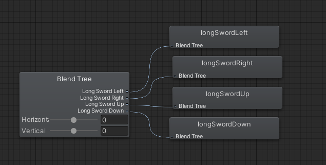 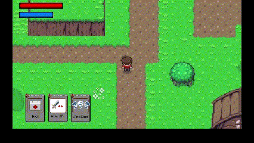 

The hitboxes on the sword have box colliders that are turned on and off during the animation. I got the idea to do this from the before mentioned video tutorial, except I modified it so instead of one big hitbox there's smaller, finer boxes that closely follow the animation. 

I used a longer sword than the one that came in the default sprite sheet, found in YouTube comment by user Enderesting at [this link](https://imgur.com/a/6lxX3FI) (Adapted from the Zelda-Like Tilesets and Sprites, cited later in world section: https://opengameart.org/content/zelda-like-tilesets-and-sprites This has a CC0 1.0 Universal Public Domain Dedication)

Card System-

I worked with Julio on the basic logic of how this would work, but then I ended up focusing on the mechanics while he focused on the visible interface.

Whenever the game is being played, there is an active hand. The two hands are the [standard combat hand](https://github.com/CardCaster-UCD/CardCasterGame/blob/0bb9427be1399cdf105a495f8aaa034b2c2e6557/Assets/Scripts/HandController.cs#L4) and the [puzzle hand](https://github.com/CardCaster-UCD/CardCasterGame/blob/0bb9427be1399cdf105a495f8aaa034b2c2e6557/Assets/Scripts/PuzzleHandController.cs#L4). Each hand has three objects that implement the [ICard interface](https://github.com/CardCaster-UCD/CardCasterGame/blob/0bb9427be1399cdf105a495f8aaa034b2c2e6557/Assets/Scripts/ICard.cs#L3). The [Execute() method](https://github.com/CardCaster-UCD/CardCasterGame/blob/0bb9427be1399cdf105a495f8aaa034b2c2e6557/Assets/Scripts/ICard.cs#L5) of the ICard will be called when the button corresponding to that card is pressed. This system follows the command pattern.

Which hand is active is determined by [room](https://github.com/CardCaster-UCD/CardCasterGame/blob/0bb9427be1399cdf105a495f8aaa034b2c2e6557/Assets/Scripts/RoomTransition.cs#L8) and [scene](https://github.com/CardCaster-UCD/CardCasterGame/blob/0bb9427be1399cdf105a495f8aaa034b2c2e6557/Assets/Scripts/SceneTransition.cs#L8) transitions. The scripts for both have a serialized bool that determines whether to switch hands when the transition is triggered. The regular hand is active at the start, and the puzzle hand is switched to by disabling the regular hand and enabling the puzzle hand when entering a puzzle. This is to ensure that the player always has the cards they need for a puzzle.

The regular hand controller is [initialized](https://github.com/CardCaster-UCD/CardCasterGame/blob/0bb9427be1399cdf105a495f8aaa034b2c2e6557/Assets/Scripts/HandController.cs#L25) by setting up the player reference, deck reference, and discard reference, and then drawing three cards. It does this the first time it is activated. If it is activated and it has already been activated it only [changes what's shown on the screen for the cards](https://github.com/CardCaster-UCD/CardCasterGame/blob/0bb9427be1399cdf105a495f8aaa034b2c2e6557/Assets/Scripts/HandController.cs#L46).
Every frame the hand controller checks [if any of its current cards have already been used](https://github.com/CardCaster-UCD/CardCasterGame/blob/0bb9427be1399cdf105a495f8aaa034b2c2e6557/Assets/Scripts/HandController.cs#L54). Then it draws a card and sends the current card to the discard pile. It sends the current card to the discard pile after drawing to ensure that the current card is never redrawn, since the discard pile periodically gets shuffled back into the deck.

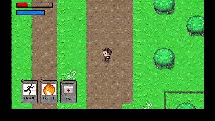

When the deck is initailized, it shuffles a [list of all cards we currently have implemented](https://github.com/CardCaster-UCD/CardCasterGame/blob/0bb9427be1399cdf105a495f8aaa034b2c2e6557/Assets/Scripts/DeckController.cs#L23) into the deck. We were originally going to have these cards be collected as you play the game, but we did not have time to create that system. The [shuffling of the cards](https://github.com/CardCaster-UCD/CardCasterGame/blob/0bb9427be1399cdf105a495f8aaa034b2c2e6557/Assets/Scripts/DeckController.cs#L36) is done by randomly choosing cards from the given list, and pushing them to the top of the stack until every card from the list has been picked and removed. This is what causes the unpredictability of the spell system.

The [discard pile](https://github.com/CardCaster-UCD/CardCasterGame/blob/0bb9427be1399cdf105a495f8aaa034b2c2e6557/Assets/Scripts/DiscardController.cs#L4) simply stores all the cards that have already been used in a list. When the hand tries to draw and the discard pile is empty, [the discard pile gets shuffled back into the deck](https://github.com/CardCaster-UCD/CardCasterGame/blob/0bb9427be1399cdf105a495f8aaa034b2c2e6557/Assets/Scripts/DeckController.cs#L13). Thus, the player never runs out of cards.

The puzzle hand is just like the regular hand, except it doesn't switch out any cards. It always has the two cards used in the puzzle, [Fireball and WindBlast, and a third inconsequential card](https://github.com/CardCaster-UCD/CardCasterGame/blob/0bb9427be1399cdf105a495f8aaa034b2c2e6557/Assets/Scripts/PuzzleHandController.cs#L29).

Spells-

The three spell cards I implemented were [Fireball](https://github.com/CardCaster-UCD/CardCasterGame/blob/9528914bf36446d0e72e71c630e13477a702ae64/Assets/Scripts/FireballCard.cs#L3), [WindBlast](https://github.com/CardCaster-UCD/CardCasterGame/blob/9528914bf36446d0e72e71c630e13477a702ae64/Assets/Scripts/WindBlastCard.cs#L3), and Speedup.

Fireball was the first spell implemented, so while making this one I learned some things about how we should make spells. I made it, and future spells, ScriptableObjects because I ran into issues instantiating prefabs from MonoBehaviors. It works by loading the [fireball prefab](https://github.com/CardCaster-UCD/CardCasterGame/blob/9528914bf36446d0e72e71c630e13477a702ae64/Assets/Resources/Prefabs/Fireball.prefab) using Resources.Load, which requires the prefab to be in the Resources folder. [It gets the direction that the player is facing, and sets the velocity in the x and y directions based on that](https://github.com/CardCaster-UCD/CardCasterGame/blob/9528914bf36446d0e72e71c630e13477a702ae64/Assets/Scripts/FireballCard.cs#L14). The velocity is set on the [spell movement script](https://github.com/CardCaster-UCD/CardCasterGame/blob/9528914bf36446d0e72e71c630e13477a702ae64/Assets/Scripts/SpellMovement.cs#L5) attached to the fireball object. It instantiates the fireball, [with a lifetime which is currently set to 2.5 seconds](https://github.com/CardCaster-UCD/CardCasterGame/blob/9528914bf36446d0e72e71c630e13477a702ae64/Assets/Scripts/WindBlastCard.cs#L3). Gian handled the damage effect of these fireballs on enemies, and Grant handled the effect of lighting torches. I created the animation using sprites found in the [Top Down Adventure Assets](https://assetstore.unity.com/packages/2d/environments/top-down-adventure-assets-173199#description). (This has a Standard Unity Asset Store EULA license)

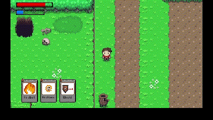

The WindBlast spell was very similar to the FireBall spell. Only major difference was the animation and how it affects enemies. I made it so if the whirldwind hits one of the enemies, [it attaches to the enemey](https://github.com/CardCaster-UCD/CardCasterGame/blob/6c5c93cce11076e3f765c4d1f17bc82bd7f26138/Assets/Scripts/EnemyController.cs#L101) and [carries the enemy with it through the life of the whirlwind](https://github.com/CardCaster-UCD/CardCasterGame/blob/6c5c93cce11076e3f765c4d1f17bc82bd7f26138/Assets/Scripts/EnemyController.cs#L58). [I made the animation by slicing up a spritesheet posted by Spring Spring on Open Game Art](https://opengameart.org/content/whirlwind) (Creative Commons 3.0 license)

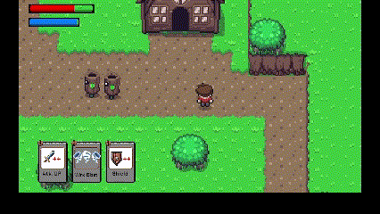

The [SpeedUp spell](https://github.com/CardCaster-UCD/CardCasterGame/blob/9528914bf36446d0e72e71c630e13477a702ae64/Assets/Scripts/SpeedupCard.cs#L3) Works by attaching a [SpeedModifer script](https://github.com/CardCaster-UCD/CardCasterGame/blob/6c5c93cce11076e3f765c4d1f17bc82bd7f26138/Assets/Scripts/SpeedModifier.cs#L3) to the player. The speed modifier [increases the player's speed by a factor during setup](https://github.com/CardCaster-UCD/CardCasterGame/blob/6c5c93cce11076e3f765c4d1f17bc82bd7f26138/Assets/Scripts/SpeedModifier.cs#L23), then [decreases it by whatever it was increased by after a certain number of seconds](https://github.com/CardCaster-UCD/CardCasterGame/blob/6c5c93cce11076e3f765c4d1f17bc82bd7f26138/Assets/Scripts/SpeedModifier.cs#L19). For the card I implemented the factor was 50% and the duration was 10 seconds.

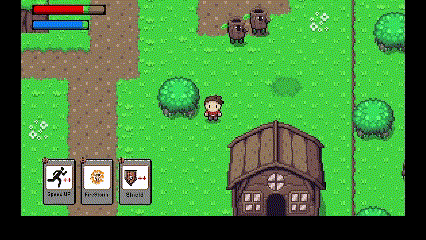

## Julio Flores
My main contributions to the combat system was creating the UI for the cards, the art for 5 spells, a buffer system for the spells, and programming one of the spell cards.

The art for the cards I designed were mainly obtained from [here.](https://cafedraw.itch.io/fantasy-card-assets) I used those assets to build the card template that was used to design all the cards. Then Using the template I made I would piece together the design for the [Attack UP,](https://github.com/CardCaster-UCD/CardCasterGame/blob/0bb9427be1399cdf105a495f8aaa034b2c2e6557/Assets/Resources/Sprites/Attack_UP_Card.png) [Shield,](https://github.com/CardCaster-UCD/CardCasterGame/blob/0bb9427be1399cdf105a495f8aaa034b2c2e6557/Assets/Resources/Sprites/Shield_Card.png) [Speed UP,](https://github.com/CardCaster-UCD/CardCasterGame/blob/0bb9427be1399cdf105a495f8aaa034b2c2e6557/Assets/Resources/Sprites/Speed_UP_Card.png) [Fireball,](https://github.com/CardCaster-UCD/CardCasterGame/blob/0bb9427be1399cdf105a495f8aaa034b2c2e6557/Assets/Resources/Sprites/FireBall_Card.png) and [Firestorm](https://github.com/CardCaster-UCD/CardCasterGame/blob/0bb9427be1399cdf105a495f8aaa034b2c2e6557/Assets/Resources/Sprites/FireStorm_Card.png) cards.

The Firestorm spell was fairly easy to make because at the time Elios just finished making the fireball spell, so I was able to repurpose what he wrote for fireball making it so that firestorm shot a fireball in every direction. Originally FireStorm was supposed to have a different name and throw a different object, but after seeing the spell in action with the fireball we decided to keep it. The original spell for fireball was scraped due to not being able to find an asset to match my original idea.

The buffer system I wrote made it so that the player would have to wait a quarter of a second before the being able to use another spell this made it so that the player can not press 1,2, or 3 simutaneously so that they could activate all their spells at once.

The Hand UI is fairly simple. I created a UI document and made three visual elements to store the card's art. When the player would draw a card I made it so that the appropriate card art would apear on the screen allowing the player to know what card was drawn and which key it should be binded to. If the card apeared on the left most slot then 1 needed to be presed, 2 for the middle, and 3 for the right most card. Initially the card was supposed to be dynamically made so that the player could hover over specific part of the card so that they could get an explination of what that element of the card indicated. However When I made the initial document I assumed it would work for all the resolutions, but I was wrong. The dynamic building of the cards only worked for one resolution and would be improperly made if anyother resolution was used. Due to time constraints I was unable to find a proper solution and had to use the simpler method of just loding an image. 

## Gian Carlo Lambert

My main contribution to the combat team were the addition of enemies, three cards, and health and mana indictors.

The enemies were implemented with the help of the [A* Pathfinding project](https://arongranberg.com/astar/). [I used this tutorial as a guide.](https://www.youtube.com/watch?v=jvtFUfJ6CP8&ab_channel=Brackeys) The way the package works is by including a the pathfinder component, which can be placed in a gameobject at the top of the scene hierarchy. Then, it can be configured as a 2D grid for games like ours. The component then automatically scans the area to look for obstacles or other colliders. In our case, our tilemaps worked seamlesly with the package. Then the enemy included two other components, the seeker and distination setter scripts from the A* package. The destination setter was hooked up to the player instance. The enemy also features a finite state machine. When the enemy controller senses movement, [the animation transitions.](https://github.com/CardCaster-UCD/CardCasterGame/blob/9528914bf36446d0e72e71c630e13477a702ae64/Assets/Scripts/EnemyController.cs#L47). The state machine has a sleep state, wakeup state, and walking state.
The enemy controller also features a collider that listenes for collitions against every projectile. This is done through the tags on each [kind of projectile](https://github.com/CardCaster-UCD/CardCasterGame/blob/9528914bf36446d0e72e71c630e13477a702ae64/Assets/Scripts/EnemyController.cs#L79). The enemy controller also has a damage buffer which makes sure that the player cannot spam attacks. Everytime the enemy receives damage, the [buffer timer](https://github.com/CardCaster-UCD/CardCasterGame/blob/9528914bf36446d0e72e71c630e13477a702ae64/Assets/Scripts/EnemyController.cs#L110) gets reset. 

The three cards I made were attack up, healup, and shield. The attack up card was designed by Julio. I implemented the script [AttackModifier](https://github.com/CardCaster-UCD/CardCasterGame/blob/9528914bf36446d0e72e71c630e13477a702ae64/Assets/Scripts/AttackModifier.cs#L4) and [AttackUpCard](https://github.com/CardCaster-UCD/CardCasterGame/blob/9528914bf36446d0e72e71c630e13477a702ae64/Assets/Scripts/AttackUpCard.cs#L5). When the attack up card is used by the player, the attackModifier is attached to the player. During the lifetime of this component, the [sword damage of the player gets increased](https://github.com/CardCaster-UCD/CardCasterGame/blob/9528914bf36446d0e72e71c630e13477a702ae64/Assets/Scripts/PlayerController.cs#L129). Also, the card produces an [aura of power](https://github.com/CardCaster-UCD/CardCasterGame/blob/master/Assets/Resources/Prefabs/power_up.prefab) around the player. I drew and animated the sprite for this aura by hand.
The same procedure happens when the shield card is activated. however, the sprite for the shield gets generated. Also, the absortion property is increased, instead of the health. The absortion is affected through the [health modifier script](https://github.com/CardCaster-UCD/CardCasterGame/blob/9528914bf36446d0e72e71c630e13477a702ae64/Assets/Scripts/HealthModifier.cs#L3).
The heal up spell directly calls the player Heal method and creates the sprite.

The health and bar indicators was initially influenced by the health bar in exercise 4. However, the bars live inside of the UIdocument gameobject instead.The value child object is rescalled accoding to the current health of the player. The main challenge with the implementation was learning the API for the UI components. The sprites were borrowed from a [guide on youtube](https://www.youtube.com/watch?v=BLfNP4Sc_iA&t=1018s&ab_channel=Brackeys).

## World Team

Emily Liu, Jeehoon Kim

The world team focuses on choosing the theme of the game, building maps according to the theme, integrating the combat with the puzzle, and getting the appropriate audio source for the game.

For this game we decided on a fantasy theme and setting, and the design of the world consists of a valley with surrounding forest, that leads to and includes a cave entrance. We chose to have a valley bordered by forests on 2 sides, because we needed the player movement to be linear and guide them towards the cave. The cave is where the puzzle portion of the game is. The puzzle room of the cave includes 2 other entrances that lead deeper into the cave. The golden entrance leads to a cave room with the treasure box, and the dark entrance leads to a bigger cave room where there are enemies for the player to fight. 

Tilemaps for the world were made using the Tiled map editor. [link to source for Tiled map editor](https://www.mapeditor.org/) The outside world consists of a valley with a surrounding forest as well as a waterfall. The waterfall is connected to a lake, which has a bridge that the player needs to cross in order to get to the cave. Tilemaps were ported into Unity using SuperTiled2Unity for the player to move around on. [link to source for SuperTiled2Unity](https://seanba.com/supertiled2unity.html)

As we were integrating the combat section with the puzzle section, we thought of ways to make the puzzle section and the combat section complement each other. As a result, we decided that it would be better to move the final obstacle of the puzzle section inside the combat room. (At first, the cave puzzle was designed in a way that it was possible to skip the combat room entirely.) By doing this, we were able to guide the player to the combat room at the mid-point of the puzzle section. When the player enters the combat room, the exit gets blocked with a rock to show the player that they have to do something to get out. This forces the player to fight the enemies inside the combat room as well as finish the last sequence of the puzzle, which destroys the rock that blocks the exit. Then, the player is naturally led to the treasure room at the end. Overall, this change lets the player go through all of the main contents inside the game in this order:

1. The player enters the puzzle cave.
2. The player solves 2/3 of the puzzle. (This leads the player to the combat room)
3. The player enters the combat room, fights enemies.
4. The player solves the last 1/3 of the puzzle inside the combat room to get out.
5. The player is led to the treasure room.

(Rearranging the puzzle inside the combat room)

[link to source for Tileset mainly used for the world](https://opengameart.org/content/zelda-like-tilesets-and-sprites)

License: CC0 1.0 Universal

Sprites:

Map made using tileset:

(Village map which was not used)

(Valley section that leads to the puzzle cave)

[link to source for additional Tileset used for caves](https://opengameart.org/content/cave-tileset-0)

License: Attribution 3.0 Unported, GNU General Public License, version 2

(Combat room that can be entered inside the puzzle cave)

(Treasure room that can be reached when all of the puzzle and combat are cleared)

## Puzzle Team
The main focus of the puzzle team was to coordinate between world and combat teams to create implement features in the world for players to interact with. This keep kept us integrated in many aspect of the game's design like movement/physics and animation/visuals through interactables like:
* vector effector plates (river tiles) - Alexis 
* torches and moveable rocks - Grant

Our main puzzle map layout is 2 vertical and 3 horizontal river streams. These streams apply force to the player when entering the stream to move the player down stream in the direction of the current. The currents' speed is set to mvoe the player at a speed where they should not be able to reach the other side without something to block their path. Interactable torches are placed around the map to toggle the elevation of rocks that will block the player's path as they flow downstream. 

### Alexis
For the puzzle team, the main contributions I made were creating the puzzle in a [tiled map editor](https://www.mapeditor.org/), adding player animations for swimming, creating a tutorial sign, and implementing the physics of the vectors in the river streams.  

For the tiled map named [puzzle-cave](https://github.com/CardCaster-UCD/CardCasterGame/blob/79465cb8f83c120cf164bac725d92e4353a9b360/Assets/SuperTiled2Unity/Import/puzzle-cave.tmx#L1), I used these cave tilesets [1](https://opengameart.org/content/cave-tileset-0) and [2](https://opengameart.org/content/zelda-like-tilesets-and-sprites). Grant designed the puzzle and gave me a quick mockup of what to build. In order to add visual cues to the player of which direction the stream was going, I decided to animate some of the tiles in the water to make them look like arrows. The main difficulty I had in doing this was being able to match the tiles to the ground we already had set in the cave. I ended up going into a pixel editor called [pixilart](https://www.pixilart.com/) and created some custom tiles to be able to utilize the ground we liked with the water tiles we liked, since they were from two different tilesets. I did a custom dithering between the two tiles to achieve a nice gradient effect that blended the two pieces together well. While this didn’t affect the gameplay or actual functionality of the puzzle, I believe it added meaningful visuals and aesthetics that were more pleasing to the eye. Below are images of the custom tiles I made and the tiles that they were made from. I also included an image of where I used them.  
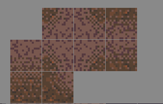
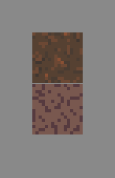
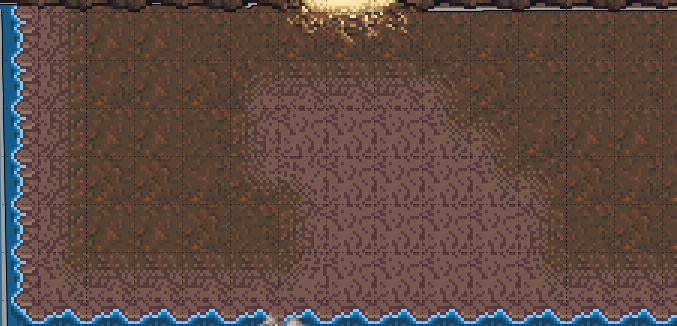

In the tilemap, I also made a simple poof animation that is played with the rocks when they disappear. 
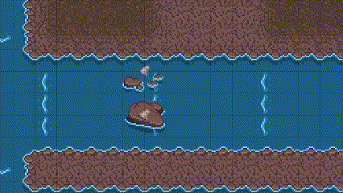

In regards to the player animations, I didn’t like that the player was going to just be walking on the water - it didn’t feel right. I used the unity animation system to add a custom animation using the sprites we already had. However, the sprites I wanted to use were only facing one direction, so again I used the pixel editor to be able to flip the sprites around into the directions I wanted. From there it was a simple animation for SwimUp, SwimDown, SwimLeft, and SwimRight. I then hooked these up to a blend tree called Swim that was attached as a transition from any state on the player’s animation. I then created this small [SwimController.cs](https://github.com/CardCaster-UCD/CardCasterGame/blob/79465cb8f83c120cf164bac725d92e4353a9b360/Assets/Scripts/SwimController.cs#L5) script that checked to see if the player was touching the water. If they where it would transition the Animation state to “Swim”. I believe this added needed game feel to see that the player was swimming. 
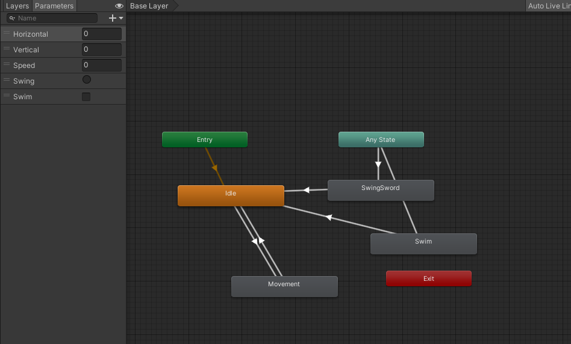

For the tutorial sign, I simply added an extra collider to the sign as a trigger to show the message. The message was implemented using a canvas and a sprite text box image from the tilesets I listed above. The text is simply displayed as the player triggers the collider and taken down when the player exits the collider. The script [here](https://github.com/CardCaster-UCD/CardCasterGame/blob/79465cb8f83c120cf164bac725d92e4353a9b360/Assets/Scripts/PuzzleInstructions.cs#L6) is attached to the sign.  

The most difficult part of my parts of the puzzle was implementing the vectors. I ended up creating objects around each row of arrows inside the tilemap editor. I also made objects for each full stream of water. In order to implement the pushing of the stream on the player, I attached an Area Effector to each row of arrows as well as each stream. I referenced this [video](https://youtu.be/p0n6EFR1M8c) by Brackeys in order to implement the area effectors. These basically apply a force to whatever object enters it, and the force is a serialized value in the unity editor. It took a bit of trial and error to get the forces to where the player could not swim backwards, but eventually I found a value for the row of vectors and the streams that seemed to work well. It added a nice effect too by having essentially more force where there was a row of water, making it feel like it was a big wave of water pushing you. The next complicated part was figuring out a way so the player couldn’t get out of the water without using the rocks to hold you against the stream. In order to do this, I created a lot of small box colliders surrounding all the ground edges that were touching the water, and only left small gaps where the player could get out if they were using the rock to help them. These gaps were made pretty small to try to keep the player from exiting “illegally”. I also had to adjust the force on the water at this point to make the player go fast enough (but not too fast) so they couldn’t easily enter these small gaps without using the rocks.

### Grant
The interactable torches are ignited when hit by any fire type spell and extinguished when hit by a wind type spell. These torches implement a [Publisher/Subscriber](https://github.com/CardCaster-UCD/CardCasterGame/blob/ea08a3673cb4325d2029ab6905b16ba98688e8a3/Assets/Scripts/TorchController.cs#L95) pattern similiar to the Pikimi assignment in week 4. In the case of the example gif, the subscriber is the fade in/out animation of a rock sprite in the river. These torches were implemented with this pattern in mind for future resuse of scripts and prefabs in later areas of the map. Examples of subscribers in the project are:
* [RockController Script](./Assets/Scripts/RockController.cs)
* [Torch Mux Script](./Assets/Scripts/PuzzleCave/TorchMuxScript.cs) (unused in current release)

**Ref**
* [torches assets](https://asymmetric.itch.io/mideval-2d-16x16-torch-sprite-pack-with-animations)

## Subroles

## Audio
**List your assets including their sources and licenses.**

**Describe the implementation of your audio system.**

**Document the sound style.** 

### Emily Liu:

### OpeningScene audio:  
Source: Enchanted by Keys of Moon | https://soundcloud.com/keysofmoon
Music promoted by https://www.chosic.com/free-music/all/ 

Scene specific audio was implemented by adding an Audio Source under the scene hierarchy. 
The sound style for this is fantasy-like, magical, and peaceful when the player is exploring the forest area.

License: Creative Commons CC BY 4.0
https://creativecommons.org/licenses/by/4.0/

### WindBlast spell audio:
Source: https://soundbible.com/1247-Wind.html

License: Attribution 3.0

This audio was tied to the instantiation of a prefab, so for the implementation, I added this audio source as a component of the Wind prefab. 

For Fireball and FireBlast, they are both tied to the Fireball prefab but FireBlast created many Fireballs so I couldn't simply add the audio source as a component of the prefab or else the FireBlast audio would be very loud and garbled. Instead, I made an audio source on the playerController script and passed in the needed audios as fields of the playerController script, and used `PlayOneShot()` to play the audio when the action was executed. 
This method is used for Speedup and Grunt as well.

[link to code in playerController script](https://github.com/CardCaster-UCD/CardCasterGame/blob/a957a9dd52c12c7b03821def52426d829c0eb7ed/Assets/Scripts/PlayerController.cs#L24)

Example: [link to FireBlast audio code](https://github.com/CardCaster-UCD/CardCasterGame/blob/a957a9dd52c12c7b03821def52426d829c0eb7ed/Assets/Scripts/FireStormCard.cs#L31)

### Fireball spell audio:
Source: https://soundbible.com/1356-Flame-Arrow.html

License: Attribution 3.0

### FireBlast spell audio:
Source: https://soundbible.com/1135-Torch.html

License: Attribution 3.0

### Speedup spell audio:
Source: https://soundbible.com/1636-Power-Up-Ray.html

License: Attribution 3.0

### Character Grunt audio:
Source: https://opengameart.org/content/grunt-2

License: Attribution 3.0

### Jeehoon Kim:

### Start Menu audio:
Source: https://assetstore.unity.com/packages/audio/music/action-rpg-music-free-85434

License agreement: [Standard Unity Asset Store EULA](https://unity3d.com/legal/as_terms)

Epic, fantasy-like music for the start menu.

### Puzzle Cave & Combat Room audio:
Source: https://assetstore.unity.com/packages/audio/music/action-rpg-music-free-85434

License agreement: [Standard Unity Asset Store EULA](https://unity3d.com/legal/as_terms)

Mysterious, somewhat dark music for the puzzle and the combat which takes place inside a cave.

## Gameplay Testing
Elios-

[The full results of playtesting can be found here](https://github.com/CardCaster-UCD/CardCasterGame/blob/c10460a0c0b56e9a0d94a74d8b56e7e77523c23e/Docs/PlaytesterFeedback.pdf).

I found that the criticisms fell into the three categories of usability, difficulty, and bugs.

Usability- 
Every player had issues with usability. It wasn't always clear what the objectives were or what options you had. Players often didn't know where they were trying to go.
Another common usability complaint was information given to the player. There was no way to tell when you hurt enemies. It wasn't clear from the numbers how much of your mana spells would actually cost, and the mana numbers were confusing because sometimes they were in the same range as the button numbers. Players wanted timers to indicate how long it would take for a spell to wear off.
Some players found the basic concept of spells switching when you use them confusing, though some thought it was an interesting mechanic. I think all would agree however that it should have been better explained, and it would be better to know what was in your deck.
Players found it clunky that the sword didn't push back the enemies, because they were used to that in other similar games.

Difficulty-
Most players found the combat to be too difficult. It took several hits to kill the enemies, and the enemies were fast enough that they could easily swarm you. However, not every player found the combat difficult, so perhaps being able to adjust the difficulty would be ideal.

Bugs- 
There were two major bugs that kept being found in playtesting. It was possible to trigger a bug that caused the player to be invincible, though I was never able to see exactly how it was triggered. It was also possible to bypass the puzzle if the player was persistent enough at trying to get out of the river at the right spot. The only other bugs the players discovered were graphical.

The elements that the players most commonly enjoyed were the graphics and sound. They had a retro feel to them that players, especially Zelda players, really seemed to resonate with. Players were most often satisfied when they completed the puzzle. Some of the players liked fighting the enemies.

The most common suggestions for what players wanted added were  more information, more rewards, and more content.

Players thought this game would be suitable for all ages, and would recommend it to retro Zelda fans.

## Press Kit and Trailer

### Trailer

I ended up spending a lot of time making the trailer because it was my first time editing a video. I wanted to have a way to introduce the game's title, but we did not have an logo for the title, and I did not have time to make one, so I decided to have the text be masked with some of the gameplay to make introducing the games title seem a little more interesting. I chose the clips I used because I thought they showed off the core game play. I initially wanted to show off more of the cards in action while fighting enemies, but at the time I was recording the clips we had a lot of bugs in the code so a lot of things did not work properly making it difficult to get clips that looked good. For example the build I was running at the time had a bug where the player could not take damage so I had to avoid getting close to enemies in fear of getting hit and not taking any damage. I chose to end the trailer with comming soon because I did not know how to end the trailer without it looking odd. Themusic that was being played was the one we had for the start menue of the game I thought I sounded good for the trailer an just went ahead and used the same song.  

The Presskit can be found [here](https://github.com/CardCaster-UCD/CardCasterGame/blob/master/Presskit.md)

Similar to how in the trailer I chose clips, I chose the images because I thought they reflected core elements of the game. I did have some diffuculty getting a few screenshots due to the fact I could not pause the game so I was limited in what I could screenshot. For the description I decided to give some explanation about the core mechanics using some lore from the game. We did not have time to put narative elements into the game so I thought it would be a good Idea to include a generic Narrative for the game. The games main character was named Casper in the making of the presskit and trailer because I thought that giving him a name would make the game a little more memeroble.

## Cross-Platform
Card caster currently builds for Window/MacOS/Linux in standalone executables and WebGL. Consideration was made for user controls for Android and iOS builds of the game but due to time constraints, direct mappings of the touch interface to controlls are not availiable to the mobile versions of the game at this time. However, builds of the game do exists for iOS and Android, but without the aid of a keyboard, will be unplayable. 

Builds are generated automitically on push events to the Card Caster repository through the [Game.ci](https://game.ci/) project.
Latest builds are availiable under the actaions page of our [Github](https://github.com/CardCaster-UCD/CardCasterGame/actions)

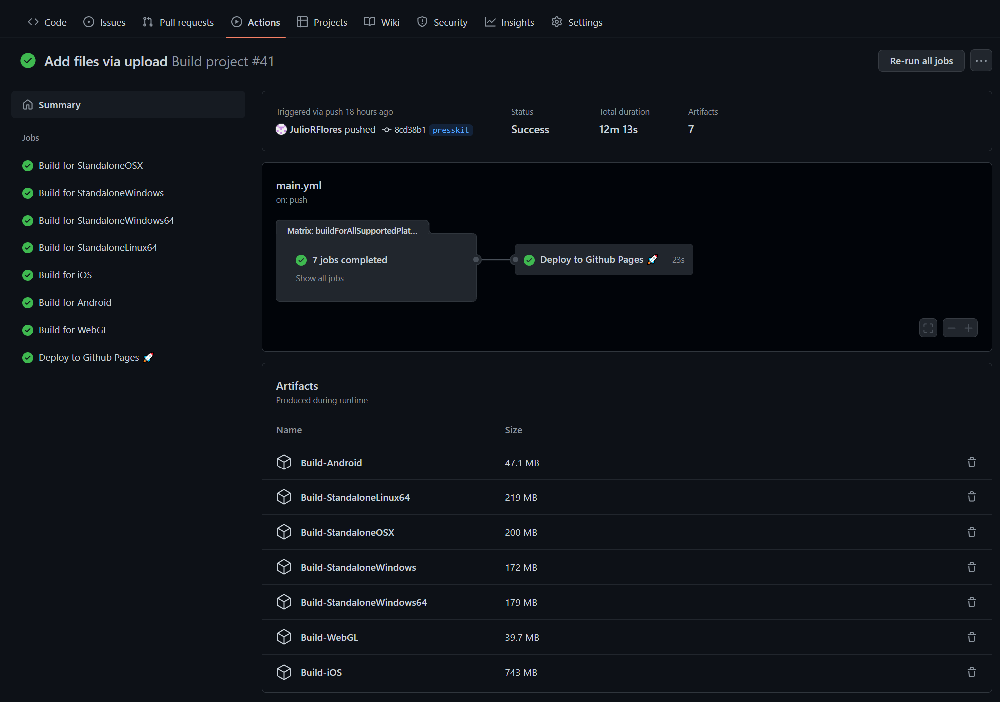

## Integration

Alexis-
My subrole was centered around being sure that everything was integrated well and that our game felt like a unified and consistent game. My team did a very good job of doing this themselves, but throughout the development I gave some suggestions in order to improve the integration of our game as a whole.

One integration task that I suggested to my teammates was creating separate scenes for the different areas of our game, ie one scene for the combat and one scene for the puzzle. This allowed the combat team to work together on their scene independently of Grant and I on the puzzle team to avoid unnecessary merge conflicts. I also suggested creating a main scene that gets loaded everywhere that contained the player and the camera, since these would remain the same throughout the game. I think these suggestions to my team allowed us to be able to work freely, and still together, and cause the least amount of headaches possible. Elios was able to implement my suggestions by creating a MainScene, UI Scene, and Level Scenes (the combat scenes and puzzle scene). He along with Grant created beautiful scene transitions between each scene.

Another integration task that I implemented was in the development of our puzzle in the cave. Grant’s original design of the puzzle had the player enter from the left. However, I noticed that the world team had made the entrance to our cave in such a way that the player was walking up into the cave. I knew it would feel weird if the player entered the cave on the left, and so I decided to flip the puzzle around in such a way that the player was instead entering from the bottom. 

After we added the final treasure room and ran through the game, I realized that something was missing. I was playing the game and it felt weird that the player just enters the last room we have and all we tell them is “You found the treasure!” I thought that this didn’t really integrate well and show the player that they had finished our game, so I suggested to my team to add some kind of “You Win!” indication so that the player knows that they reached the end of our game. My teammates agreed and quickly altered the message to what it is now.

# Roll Agnogstic Tasks
## Grant Gilson
* Player Movement Controller 
   * Heavily referenced from [Mister Taft Creates](https://www.youtube.com/watch?v=Vfq13LRggwk&t=289s)
   * Created simple player movement controller. In development we were using the traditional kinematic physics system (eg.`transform.position = new Vec3(...)`) to move the player. This proved to be a design challenge early on with the effector plates which reply on the Unity physics engine. Having these two movement systems caused graphical stuttering. Moving the player towards a dynamic rigid body simplified the logic for player movement, but has tradeoffs in future extensions to the player controller script in its current state. Player inputs is recieved through the unity input system through WASD/←↑→↓. This input is recieved as a unit vector which is applied to the speed factor in field of the player controller. Diagonal movement can be disabled to emulate a more traditional 2D top down game.
   * 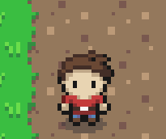 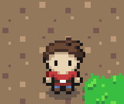
* Camera Controller
  * Heavily referenced from [Mister Taft Creates](https://www.youtube.com/watch?v=OWJa6lcFTXk)
  * This simple camera controller smoothly lerps to the player. When entering a room the camera recieves new min and max boundaries. When the camera position approaches one of these limits the camera detaches from the player, preventing it from moving outside of the camera bounds.
  * 
* Scene Transition Controller
  * Our game is composed of multiple composite scenes. As the player moves to another area the scene transition colliders specifies which scene to next load and unloads the current scene. This is done to safe processing time as enemies in other rooms that are still loaded in the scene may continue to following 
  *  

## Emily Liu
Start Menu \

Background image credit: Milksoft Games \
Source: https://milksoftgames.itch.io/grassy-field \
[link to scene in Github repository](https://github.com/GMGilsonECS-UCD/ECS189L/blob/master/Assets/Scenes/StartMenu.unity) \
[link to script in Github repository](https://github.com/GMGilsonECS-UCD/ECS189L/blob/master/Assets/Scripts/Menu.cs) \
To implement this, I created a separate scene for the Start menu and added a background image. I found a background image that matched the tilemaps of the overworld. The background image has a forest with a path. I wanted the image to feel adventurous yet peaceful. There are also buttons for PLAY and QUIT over the background image. The script includes a function to load the next scene, which is called the MainScene and starts the game. The other function quits the game. I then connected the buttons for PLAY and QUIT to these functions in the script. 
